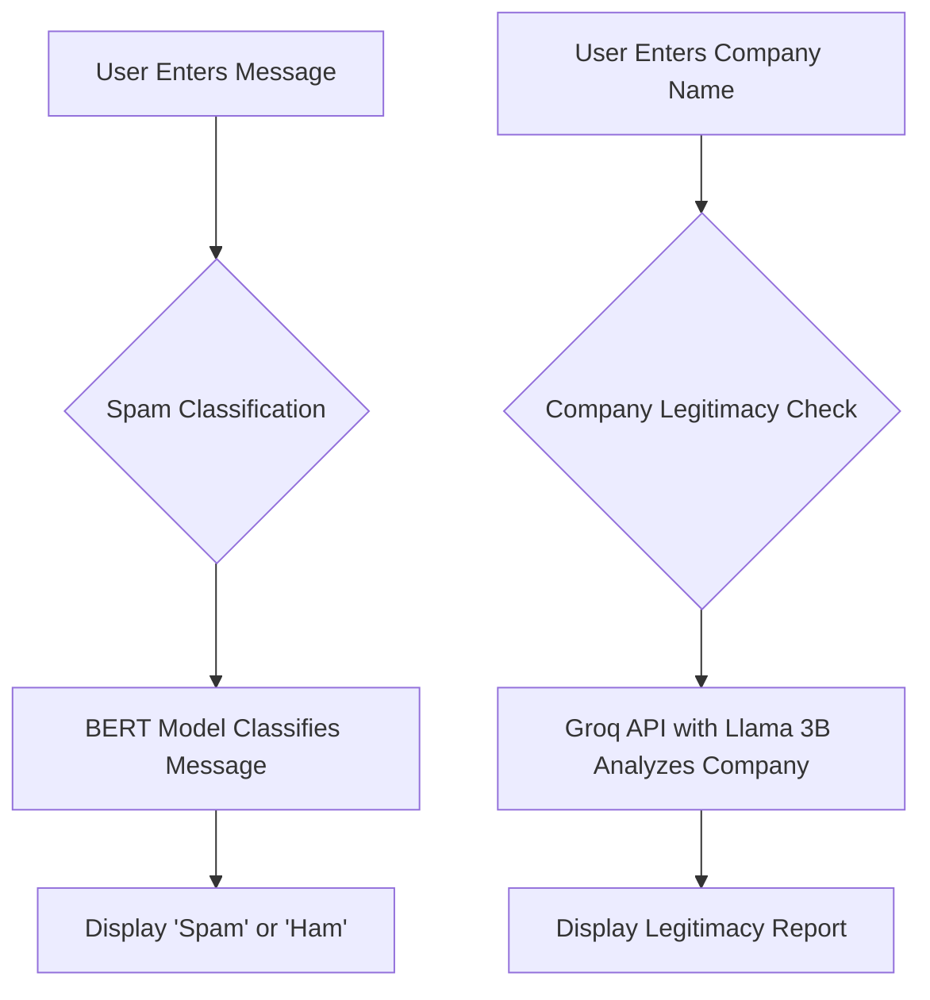

# 🛡️ Spam & Legitimacy Analyzer

A Streamlit web application that classifies messages as spam or ham (not spam) and checks the legitimacy of a company using a powerful combination of a BERT model and the Groq API.

## ✨ Features

- **Spam Classification:** Classify any message as spam or not spam.
- **Company Legitimacy Checker:** Get a quick summary of a company's legitimacy.
- **User-Friendly Interface:** A simple and intuitive interface built with Streamlit.

## 🚀 Deployed Link

You can access the deployed application here: [**Spam & Legitimacy Analyzer**](https://your-deployed-link.com)

## 🧠 The Brains Behind It

This project uses a two-pronged approach to analyze text:

1.  **BERT for Spam Classification:**
    - A pre-trained BERT (Bidirectional Encoder Representations from Transformers) model is used for spam classification.
    - BERT is a powerful language model that understands the context of words in a sentence, making it highly effective for text classification tasks.
    - The model has been fine-tuned on a spam SMS dataset to accurately distinguish between spam and ham messages.

2.  **Groq & Llama 3B for Legitimacy Checking:**
    - The Groq API, powered by the Llama 3B model, is used to check the legitimacy of a company.
    - When a company name is entered, a request is sent to the Groq API, which then provides a summary of the company's legitimacy based on its vast knowledge base.

## 🔧 How It Works

Here's a flowchart illustrating the workflow of the application:



## 🛠️ Setup and Installation

To run this project locally, follow these steps:

1.  **Clone the repository:**
    ```bash
    git clone https://github.com/your-username/your-repository.git
    ```
2.  **Create a virtual environment:**
    ```bash
    python -m venv spamvenv
    ```
3.  **Activate the virtual environment:**
    - On Windows:
      ```bash
      spamvenv\Scripts\activate
      ```
    - On macOS/Linux:
      ```bash
      source spamvenv/bin/activate
      ```
4.  **Install the dependencies:**
    ```bash
    pip install -r requirements.txt
    ```
5.  **Set up your Groq API key:**
    - Create a `.streamlit` directory in the root of your project.
    - Inside the `.streamlit` directory, create a `secrets.toml` file.
    - Add your Groq API key to the `secrets.toml` file as follows:
      ```toml
      GROQ_API_KEY = "your-groq-api-key"
      ```

## ▶️ Usage

To run the application, use the following command:

```bash
streamlit run app.py
```

## 🤝 Contributing

Contributions are welcome! If you have any ideas, suggestions, or bug reports, please open an issue or submit a pull request.

---
*Created by Sarvagya*
